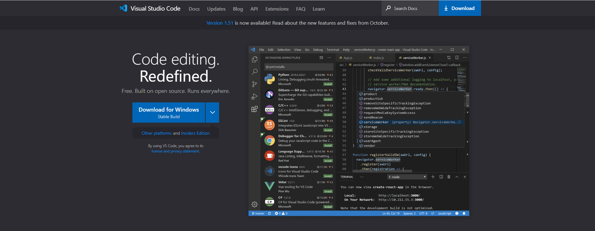
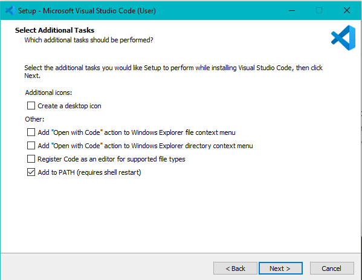
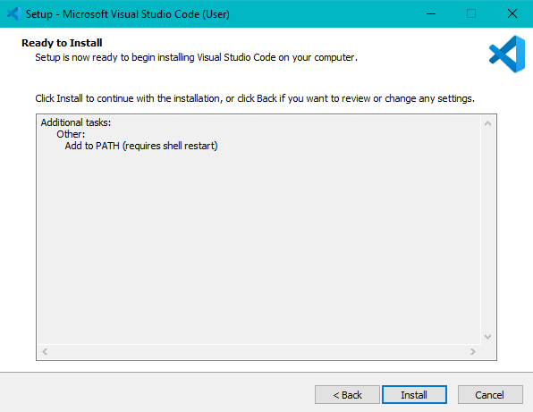
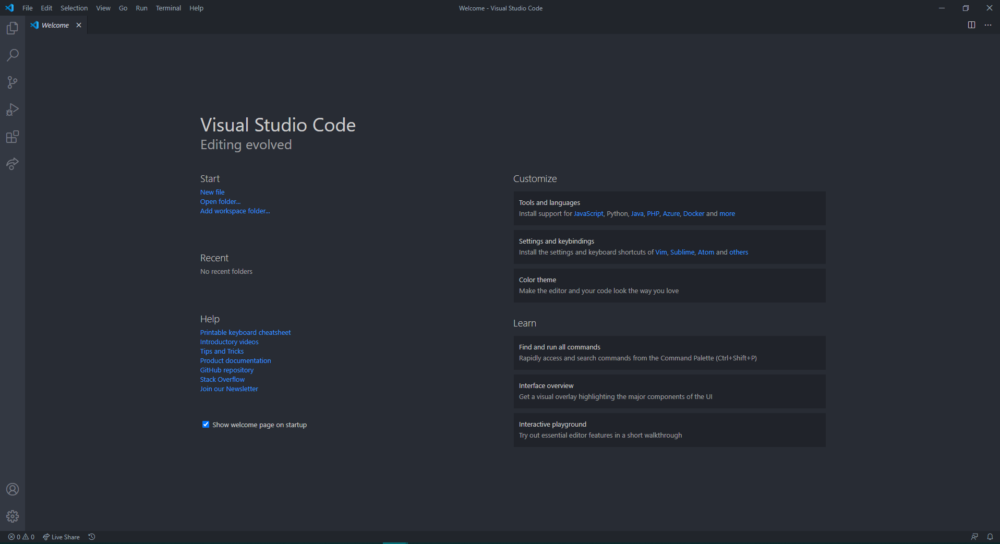
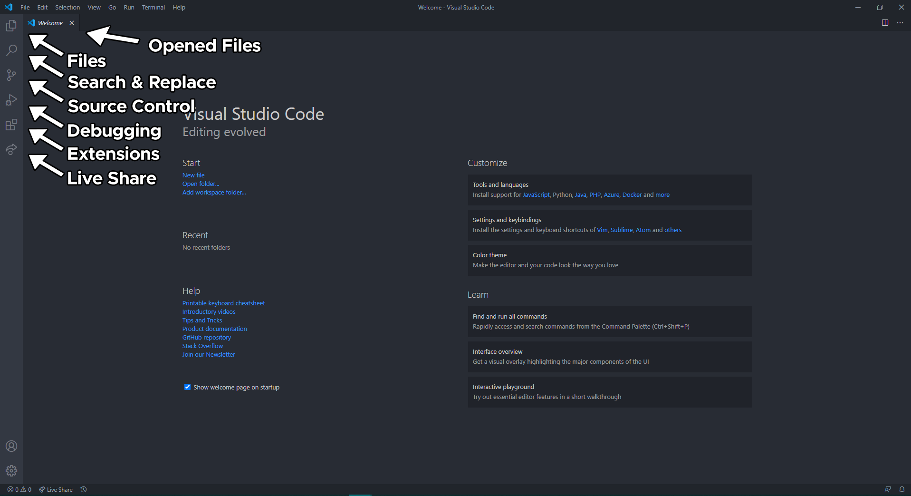

# Text Editors

Text editors are lightweight tools for quickly editing code. They're more lightweight than **IDEs (Integrated Development Environments)** as they only have syntax highlighting to quickly edit code with and do not things such as compilers.

There are many popular text editors to pick from. Popular ones include: 

- [Atom](https://atom.io/)
- [Sublime Text 3](https://www.sublimetext.com/)
- [Visual Studio Code (VSCode)](https://code.visualstudio.com/)

We will be going over the installation of VSCode in this guide as it is the most popular text editor to date and has support for a wide range of plugins. 

## Windows & MacOS

**Step 1: [Download](https://code.visualstudio.com/) the recommended stable build**

**Step 2: Run the VS Code setup. You could use the default options checked for you, or check off other options based on your preference.**

**Step 3: Confirm and finish installing**

**Step 4: Launch VS Code. This is what you should see. You may not see all 6 icons on the left, as some of them come from extensions.**

**Step 5: Here are what the different tabs on the side do. Play around with them yourself and you'll quickly get the hang of VS Code. Here are some other resources to get you started:**

- [Getting started with Visual Studio Code (YouTube)](https://www.youtube.com/watch?v=S320N3sxinE)
- [Setting up Visual Studio Code (Text)](https://code.visualstudio.com/docs/setup/setup-overview)

# Linux

If you're using Linux you already know what you're doing.